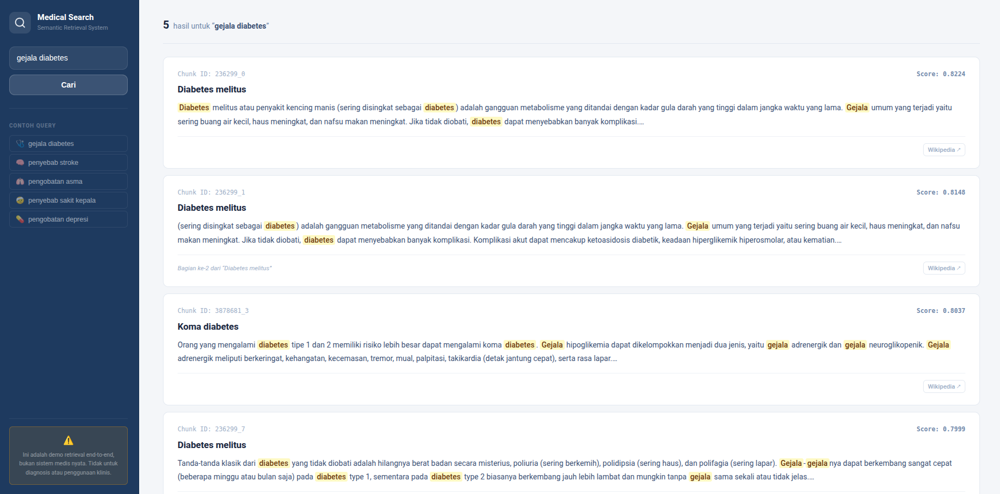

# Medical Semantic Search

Sistem semantic search untuk artikel kesehatan Wikipedia Bahasa Indonesia menggunakan pendekatan dense retrieval berbasis sentence embeddings.

Proyek ini membangun pipeline retrieval secara end-to-end: mulai dari akuisisi data, indexing offline, hingga layanan pencarian berbasis web. **Implementasi difokuskan pada baseline dense retrieval tanpa hybrid search, re-ranking, atau fine-tuning**, sehingga setiap tahap sistem dapat dianalisis secara terpisah dan transparan.

---



---

## Problem Statement

Pencarian berbasis keyword bergantung pada kecocokan kata secara literal. Dalam domain kesehatan, pengguna sering menggunakan istilah yang berbeda dari terminologi yang digunakan dalam artikel (misalnya bahasa sehari-hari dibanding istilah medis formal). Perbedaan kosakata ini dapat menyebabkan hasil pencarian yang kurang relevan.

Proyek ini mengevaluasi sejauh mana pendekatan dense retrieval multilingual dapat menangkap kesamaan makna pada artikel kesehatan Bahasa Indonesia dalam ruang lingkup dataset terbatas dan tanpa optimasi lanjutan.

### Dataset

- **Sumber:** Wikipedia Bahasa Indonesia
- **Artikel:** 338 artikel kesehatan
- **Chunks:** 5,793 paragraph chunk
- Dataset dibekukan setelah proses akuisisi untuk menjaga konsistensi evaluasi

Lihat [MODELING.md](MODELING.md) untuk detail lengkap tentang proses akuisisi data dan chunking.

### System Design

**Offline — Indexing Pipeline:** Scraping → Chunking → Embedding → Normalization  
**Online — Retrieval Flow:** Query encoding → Similarity calculation → Ranking → Display

Lihat [MODELING.md](MODELING.md) untuk detail pipeline offline dan [RETRIEVAL.md](RETRIEVAL.md) untuk detail proses retrieval.

### Evaluation

Evaluasi dilakukan pada 20 query uji dengan metrik Top-1 Accuracy, Top-3 Accuracy, Recall@5, dan MRR.

Lihat [MODELING.md](MODELING.md#06--retrieval-evaluation) untuk detail lengkap hasil evaluasi dan analisis.

---

## Features

- Semantic search berbasis dense embeddings
- Multilingual model (mendukung Bahasa Indonesia secara native)
- Cosine similarity via dot product
- Keyword highlighting pada snippet hasil
- Link langsung ke artikel Wikipedia
- Web UI sederhana (FastAPI + HTMX + Alpine.js)

---

## Limitations

- Dataset terbatas pada 338 artikel hasil keyword crawling; cakupan topik tidak komprehensif
- Evaluasi menggunakan 20 query dengan ground truth manual; ukuran evaluasi relatif kecil
- Query encoding bergantung pada HuggingFace Inference API (membutuhkan koneksi internet)
- Sistem merupakan baseline dense retrieval tanpa hybrid search, re-ranking, atau fine-tuning

Lihat [MODELING.md](MODELING.md#catatan) untuk analisis lengkap tentang keterbatasan dan trade-off desain sistem.

---

## Models Lifecycle

Pipeline end-to-end: Data Acquisition → Text Chunking → Embedding → Retrieval → Evaluation → Export

Lihat [MODELING.md](MODELING.md) untuk detail lengkap setiap tahap pipeline, output yang dihasilkan, dan konfigurasi model.

---

## Quick Start

### Docker (Recommended)

```bash
# 1. Copy .env.example (opsional, untuk override konfigurasi)
cp .env.example .env

# 2. Edit .env dan isi HF_TOKEN
# HF_TOKEN=your_huggingface_token

# 3. Build dan jalankan
docker-compose up --build

# 4. Tunggu build selesai
# 5. Buka http://localhost:8000
```

### Manual Setup

```bash
# 1. Buat virtual environment
python3 -m venv venv
source venv/bin/activate  # Linux/Mac
# atau
venv\Scripts\activate    # Windows

# 2. Install dependencies
pip install -r requirements.txt

# 3. Set environment variables
export HF_TOKEN="your_huggingface_token"

# 4. Jalankan server
uvicorn app.main:app --reload
```

## Usage

### Web Interface

Buka `http://localhost:8000` di browser. Masukkan query di kotak pencarian dan klik tombol "Cari". Hasil pencarian akan muncul di bawah tanpa reload halaman. Pilih contoh query di sidebar untuk mencoba sistem.

### API

Aplikasi ini menggunakan FastAPI dengan route utama:
- `GET /?q=query` - Semantic search dengan query parameter

Contoh:
```bash
curl "http://localhost:8000/?q=gejala%20diabetes"
```

---

## Project Structure

```
medical-semantic-search/
├── app/
│   ├── main.py              # FastAPI application
│   ├── engine.py            # Retrieval engine (semantic search)
│   ├── templates/            # HTML templates (Jinja2)
│   │   ├── index.html
│   │   └── results.html
│   └── static/               # CSS styling
│       └── style.css
├── artifacts/                # Model artifacts (embeddings, metadata, config)
│   ├── embeddings.npy
│   ├── metadata.json
│   └── config.json
├── Dockerfile
├── docker-compose.yml
├── requirements.txt
└── .env.example              # Template environment variables
```

---

## Technologies

- [FastAPI](https://fastapi.tiangolo.com/) - Web framework
- [HTMX](https://htmx.org/) - Dynamic HTML
- [Alpine.js](https://alpinejs.dev/) - Lightweight JavaScript
- [Jinja2](https://jinja.palletsprojects.com/) - Template engine
- [Docker](https://www.docker.com/) - Containerization
- [HuggingFace Inference API](https://huggingface.co/docs/api-inference) - Query encoding

**Model:**
- [sentence-transformers/paraphrase-multilingual-MiniLM-L12-v2](https://huggingface.co/sentence-transformers/paraphrase-multilingual-MiniLM-L12-v2) - Embedding model untuk semantic search (384 dim, diakses via Inference API)

---

## Environment Variables

Semua konfigurasi dapat di-set via environment variables:

- `HF_TOKEN` (required): HuggingFace API token untuk Inference API. Dapatkan di [HuggingFace Settings](https://huggingface.co/settings/tokens)

Lihat `.env.example` untuk template.

---

## Resources

#### Documentation
- [MODELING.md](MODELING.md) - Dokumentasi proses modeling (pipeline end-to-end dari data acquisition hingga export)
- [RETRIEVAL.md](RETRIEVAL.md) - Dokumentasi proses retrieval di aplikasi FastAPI


#### Training Notebooks (Google Colab)
- [00_project_setup.ipynb](https://colab.research.google.com/drive/1pu4F_r5fVkaiNxi0k7xZCg83Dj-DAQl2) - Setup environment dan konfigurasi proyek
- [01_data_acquisition.ipynb](https://colab.research.google.com/drive/11p0m-WqYETnIeiN9cnnuexWN6sICAyQD) - Scraping artikel Wikipedia
- [02_text_chunking.ipynb](https://colab.research.google.com/drive/1ozfPVMVngMh9IJxhunHcYGgO8JyYLjC-) - Paragraph chunking dengan overlap
- [03_embedding_generation.ipynb](https://colab.research.google.com/drive/1cYVzcIhnMy8HmiTCMzCpXiP0Z752mGsv) - Generate embeddings untuk seluruh chunks
- [04_retrieval_engine.ipynb](https://colab.research.google.com/drive/1QOVrbxsguh6z1-ikxucgksAlL4l_4NF6) - Implementasi semantic search engine
- [05_exploratory_testing.ipynb](https://colab.research.google.com/drive/1JT_JQ_U6o44HXUIEc7REJesF5EgTtSsA) - Pengujian kualitatif sebelum evaluasi
- [06_retrieval_evaluation.ipynb](https://colab.research.google.com/drive/1Hh0E81avSB9fD0izlJAhocfXz4tc4Apy) - Evaluasi formal dengan metrik retrieval
- [07_model_freeze_and_export.ipynb](https://colab.research.google.com/drive/1iMu_ppiTlKEqbtN2eSvlEds4nOdKKcix) - Freeze model dan export artifacts

---

## Notes

⚠️ **Aplikasi ini adalah DEMO** untuk tujuan catatan pembelajaran. Hasil pencarian tidak dijamin akurat dan **tidak untuk digunakan sebagai sumber informasi medis**.

- Dataset terbatas pada 338 artikel hasil keyword crawling
- Query encoding bergantung pada HuggingFace Inference API (membutuhkan koneksi internet)
- Artifacts (`embeddings.npy`, `metadata.json`, `config.json`) harus tersedia di folder `artifacts/` untuk aplikasi berjalan